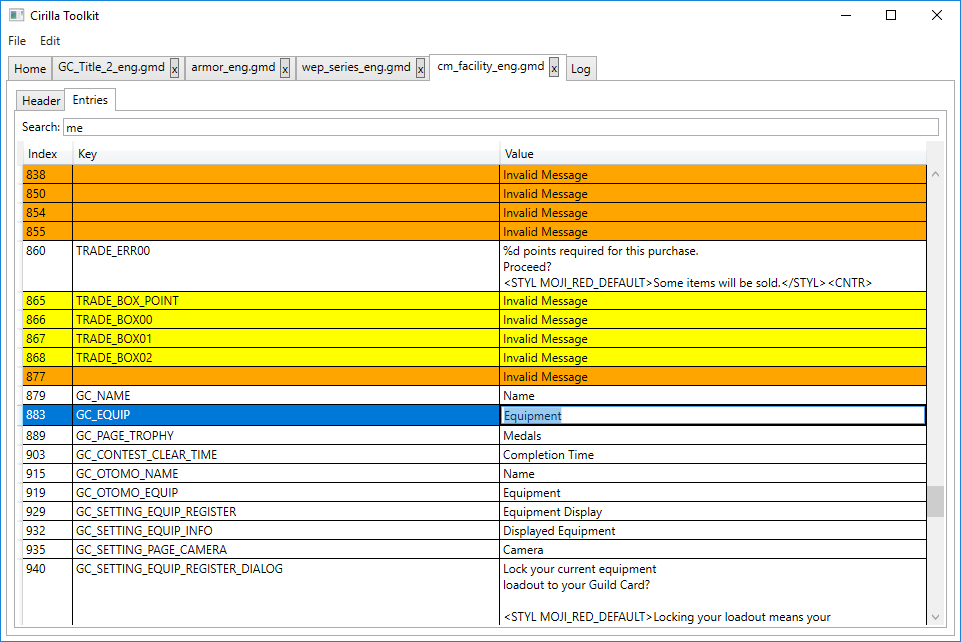
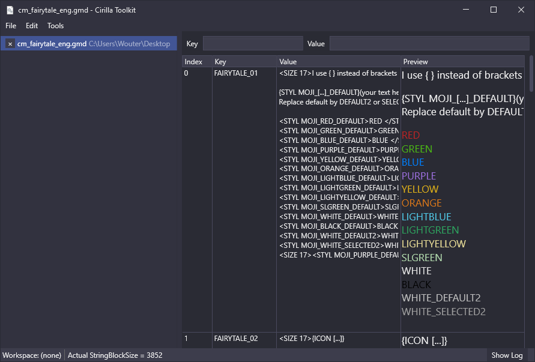

# Cirilla

Library and some tools for use with the Monster Hunter: World game.  
My other project, [MHWAppearanceEditor](https://github.com/Fusion86/MHWAppearanceEditor/), also uses the Cirilla.Core library.

## Tools

### Cirilla (legacy)

Edit GMD (game message data) files in an okayish GUI. Not updated anymore.

### Cirilla.Avalonia (unstable)

A rewrite of Cirilla using the AvaloniaUI framework.
Very unstable, and because of missing features in AvaloniaUI I ended up using WPF for the rewrite (see Cirilla.WPF).

### Cirilla.WPF (rewrite)

A more polished rewrite of the original Cirilla with a GMD preview feature. Currently under development.

## Libraries

### Cirilla.Core

Library that contains all the functionality for loading/saving GMD files and character savedata.

### Cirilla.MVVM

Shared front-end code for Cirilla.WPF and Cirilla.Avalonia.

## Utilities

### FaceEditPalette

Utility to extract the color palette that is used in the in-game character creator.

### GMDTool

Command-line tool that prints the entries inside a given GMD file.

### GstTool

Utility to extract the color codes the game uses when rendering the `<STYL MOJI_**>Colored text</STYL>` GMD entries.

## Screenshots

### Cirilla

### Cirilla.WPF

## Thanks to

- ID-Daemon and dynaomi - Getting me interested in reverse engineering
- legendff - Crypto reverse engineering
- MHVuze - [WorldChunkTool](https://github.com/mhvuze/WorldChunkTool) and documentation
- Delutto - GMD documentation
- hexhexhex - Documentation
- v00d00y - Character appearance struct documentation
- Ambytes - [MHW](https://github.com/Ambytes/MHW)
- AsteriskAmpersand - [MHW](https://github.com/AsteriskAmpersand/MHW)
- SeiKur0 - [Cheat Engine Table](http://fearlessrevolution.com/viewtopic.php?t=7642)
- TheCrazyT - [MHW-Research](https://github.com/TheCrazyT/MHW-Research)
- TanukiSharp - Optimized save crypto code + struct documentation
- Monster Hunter World Modding Discord
